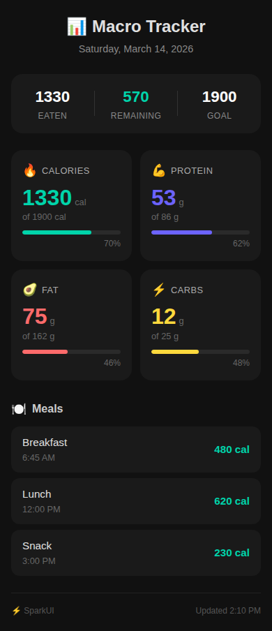
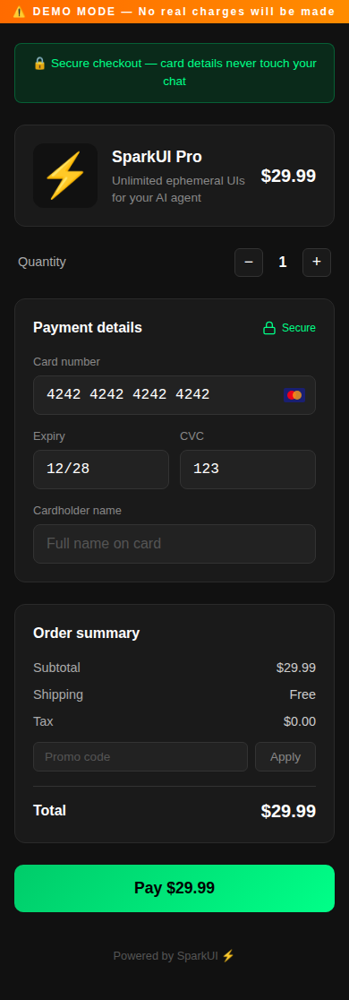
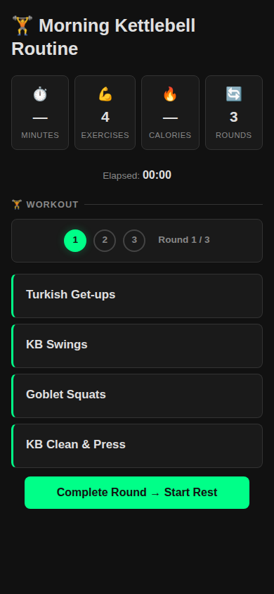
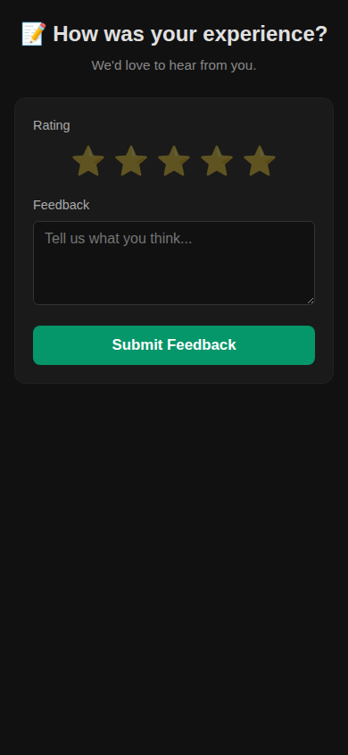

# ⚡ SparkUI

**Ephemeral interactive UIs for AI agents.** Generate rich web pages from chat — no app install required.

[](https://opensource.org/licenses/MIT)
[](https://www.npmjs.com/package/@limeade-labs/sparkui)

---

## What is SparkUI?

SparkUI lets AI agents generate interactive web UIs on demand. Instead of walls of text, your agent creates a polished, ephemeral web page and shares a link. Users click, interact, and the results flow back to the agent via WebSocket. Pages self-destruct after a configurable TTL.

- 🎯 **No app install** — just a URL that works in any browser
- ⏱️ **Ephemeral** — pages auto-expire (default 1 hour)
- 🔄 **Bidirectional** — user actions flow back to the agent in real-time
- 💾 **Persistent state** — Redis-backed, survives tab closes and server restarts
- 🧩 **Composable** — 15 components you can mix and match
- 📱 **Mobile-first** — designed for phones, works everywhere
- 🔌 **MCP compatible** — works with Claude Desktop, Cursor, Windsurf
- 🌙 **Dark theme** — easy on the eyes, polished look
- 📡 **Agent push** — send toasts, update content, and reload pages from the server side
- 🎨 **Auto icons** — emoji in templates automatically replaced with crisp Lucide SVG icons

## Quick Start

```bash
npx @limeade-labs/sparkui
# Server running at http://localhost:3457
```

Or install globally:

```bash
npm install -g @limeade-labs/sparkui
sparkui start
```

### Development Setup

```bash
git clone https://github.com/limeade-labs/sparkui.git
cd sparkui
npm install

# Configure
cp .env.example .env
# Edit .env — set your PUSH_TOKEN

# Ensure Redis is running (required for state persistence)
redis-cli ping  # Should return PONG

# Run
npm start
# Server running at http://localhost:3457
```

## Push a Page

```bash
curl -X POST http://localhost:3457/api/push \
  -H "Authorization: Bearer YOUR_TOKEN" \
  -H "Content-Type: application/json" \
  -d '{
    "template": "checkout",
    "data": {
      "product": {
        "name": "SparkUI Pro",
        "description": "Unlimited ephemeral UIs",
        "price": 29.99,
        "image": "⚡"
      }
    }
  }'
```

Returns:
```json
{
  "id": "abc123",
  "url": "/s/abc123",
  "fullUrl": "http://localhost:3457/s/abc123",
  "expiresAt": "2026-03-14T01:00:00.000Z"
}
```

## Built-in Templates

<p align="center">
  
  
  
  
</p>

| Template | Description |
|----------|-------------|
| `macro-tracker` | Daily nutrition/macro tracking with progress bars |
| `checkout` | Stripe-like checkout flow with quantity, promo codes, payment |
| `workout-timer` | Exercise routine with rounds, rest timer, checklists |
| `feedback-form` | Multi-field form with star ratings and text inputs |
| `ws-test` | WebSocket connectivity test page |

## Compose Custom Pages

Don't want a template? Compose pages from individual components:

```bash
curl -X POST http://localhost:3457/api/compose \
  -H "Authorization: Bearer YOUR_TOKEN" \
  -H "Content-Type: application/json" \
  -d '{
    "title": "Team Lunch Poll",
    "sections": [
      {
        "type": "header",
        "config": { "title": "Where should we eat?", "subtitle": "Vote by noon", "icon": "🍕" }
      },
      {
        "type": "checklist",
        "config": {
          "items": ["Chipotle", "Chick-fil-A", "Thai place on Main St"],
          "allowAdd": true
        }
      },
      {
        "type": "button",
        "config": { "text": "Submit Vote", "style": "primary", "emitEvent": "vote_submitted" }
      }
    ]
  }'
```

## Components

| Component | Description | Key Config |
|-----------|-------------|------------|
| `header` | Title, subtitle, icon, badge | `title`, `subtitle`, `icon` |
| `button` | Action button with event emission | `text`, `style`, `emitEvent` |
| `timer` | Countdown, stopwatch, or interval timer | `mode`, `seconds`, `intervals` |
| `checklist` | Tappable checklist with progress bar | `items`, `allowAdd` |
| `progress` | Single or multi-segment progress bars | `segments`, `value`, `max` |
| `stats` | Grid of stat cards with trends | `items: [{label, value, icon}]` |
| `form` | Text, number, select, textarea, star ratings | `fields`, `submitText` |
| `tabs` | Switchable content panels | `tabs: [{label, content}]` |

All components emit events via WebSocket. Dark theme. Responsive. Zero external dependencies.

## MCP Server

Use SparkUI from Claude Desktop, Cursor, or Windsurf via the [MCP server](./mcp-server/README.md):

```json
{
  "mcpServers": {
    "sparkui": {
      "command": "node",
      "args": ["./mcp-server/index.js"],
      "env": {
        "SPARKUI_URL": "http://localhost:3457",
        "SPARKUI_TOKEN": "your-push-token"
      }
    }
  }
}
```

## Page Management API

```bash
# List active pages
GET /api/pages

# Page details (includes view count)
GET /api/pages/:id

# Update page data or extend TTL
PATCH /api/pages/:id

# Delete a page
DELETE /api/pages/:id
```

All endpoints require `Authorization: Bearer <token>`.

## State Persistence (v1.1)

Pages persist state across tab closes, page refreshes, and server restarts using a layered approach:

- **localStorage** — instant write-through cache in the browser (<100ms restore)
- **REST API** — `POST/GET /api/pages/:id/state` for server-side persistence
- **Redis** — source of truth, TTL-managed, survives server restarts
- **WebSocket** — real-time sync for multi-tab scenarios

Templates like `workout-timer` automatically save and restore progress. Users can close the tab mid-workout, reopen the same URL, and pick up exactly where they left off.

## Event Delivery & Agent Push (v1.1)

### Guaranteed Event Delivery

User interactions are recorded in Redis Streams and delivered to the agent via a retry-capable delivery worker:

- Events queue in Redis Streams (survives restarts)
- Delivery worker POSTs to OpenClaw hooks or callback URLs
- Exponential backoff retries (5 attempts before dead-letter)
- No silent event loss

```bash
# Include openclaw config for event callbacks
curl -X POST http://localhost:3457/api/push \
  -H "Authorization: Bearer YOUR_TOKEN" \
  -H "Content-Type: application/json" \
  -d '{
    "template": "feedback-form",
    "data": { "title": "Quick Feedback" },
    "openclaw": {
      "enabled": true,
      "channel": "slack",
      "to": "YOUR_CHANNEL_ID",
      "eventTypes": ["completion"]
    }
  }'
```

Interactive templates (`workout-timer`, `feedback-form`, `poll`, `approval-flow`, `checkout`, `shopping-list`) auto-enable completion callbacks.

### Agent Push API

Push updates to a user's open page in real-time:

```bash
# Toast notification
curl -X POST http://localhost:3457/api/pages/PAGE_ID/push \
  -H "Authorization: Bearer YOUR_TOKEN" \
  -H "Content-Type: application/json" \
  -d '{"type": "toast", "data": {"message": "Great job! 💪"}}'

# Replace DOM element content
curl -X POST http://localhost:3457/api/pages/PAGE_ID/push \
  -H "Authorization: Bearer YOUR_TOKEN" \
  -H "Content-Type: application/json" \
  -d '{"type": "slot", "data": {"id": "status", "html": "<span>Approved ✅</span>"}}'

# Force page reload
curl -X POST http://localhost:3457/api/pages/PAGE_ID/push \
  -H "Authorization: Bearer YOUR_TOKEN" \
  -H "Content-Type: application/json" \
  -d '{"type": "reload"}'
```

### Event Query API

Query a page's event history:

```bash
GET /api/pages/:id/events
GET /api/pages/:id/events?type=completion&since=1234567890
```

## Automatic Icon Replacement (v1.2)

Emoji characters in templates are automatically replaced with inline Lucide SVG icons at serve time. No configuration needed — it just works.

- **208 mapped emojis** — navigation, status, actions, health, food, finance, weather, and more
- **Duotone rendering** — icons render with semantic fill colors for a polished look
- **< 2ms overhead** — single-pass regex replacement with pre-compiled maps
- **Accessible** — original emoji preserved as `aria-label` for screen readers
- **Safe** — content inside `<code>`, `<pre>`, `<textarea>`, and `data-sparkui-no-replace` elements is never modified

Powered by [`@limeade-labs/sparkui-icons`](https://github.com/limeade-labs/sparkui-icons).

## Architecture

```
┌─────────┐     POST /api/push     ┌──────────────┐     GET /s/:id     ┌─────────┐
│  Agent   │ ──────────────────────▶│  SparkUI     │◀────────────────── │ Browser │
│ (AI/MCP) │                        │  Server      │ ──────────────────▶│  (User) │
│          │◀── hooks/callbacks ────│  :3457       │──── REST + WS ────▶│         │
│          │─── POST /push ────────▶│  + Redis     │                    │         │
└─────────┘   guaranteed delivery   └──────────────┘   state + events   └─────────┘
```

**Flow:**
1. Agent pushes a page (template or composed)
2. Server generates HTML, stores page metadata in Redis, returns URL
3. User opens URL in any browser
4. User interacts — state auto-saves to localStorage + Redis (survives tab closes and server restarts)
5. Events flow back to the agent via guaranteed delivery (Redis Streams → webhook with retry)
6. Agent can push updates to the live page (toasts, content updates, reload)
7. Page auto-expires after TTL

## Examples

See the [`examples/`](./examples/) directory for working scripts:

- **[`basic-push.sh`](./examples/basic-push.sh)** — Push a macro-tracker page with curl
- **[`compose-page.sh`](./examples/compose-page.sh)** — Compose a page from individual components
- **[`manage-pages.sh`](./examples/manage-pages.sh)** — Full page lifecycle: list, update, delete
- **[`node-client.js`](./examples/node-client.js)** — Node.js client with WebSocket event listener

## Configuration

| Environment Variable | Default | Description |
|---------------------|---------|-------------|
| `SPARKUI_PORT` | `3457` | Server port |
| `PUSH_TOKEN` | *(required)* | Auth token for push/compose/manage APIs |
| `SPARKUI_BASE_URL` | `http://localhost:3457` | Public URL for generated links |
| `OPENCLAW_HOOKS_URL` | *(optional)* | OpenClaw webhook URL for event forwarding |
| `OPENCLAW_HOOKS_TOKEN` | *(optional)* | Auth token for OpenClaw webhook |
| `REDIS_URL` | `redis://127.0.0.1:6379` | Redis connection URL (required for v1.1 state/event persistence) |

## OpenClaw Skill

SparkUI includes an [OpenClaw](https://github.com/openclaw/openclaw) skill for direct agent integration. See [SKILL.md](./SKILL.md) for details.

## Deploy

### One-Click

| Platform | Link |
|----------|------|
| **Render** | [](https://render.com/deploy?repo=https://github.com/Limeade-Labs/sparkui) |
| **Railway** | [Deploy to Railway](https://railway.com/new/github?repo=Limeade-Labs/sparkui) |

### Docker

```bash
docker build -t sparkui .
docker run -p 3456:3456 -e SPARKUI_TOKEN=spk_your_secret sparkui
```

### VPS / Bare Metal

```bash
npx @limeade-labs/sparkui
```

Or clone for more control:

```bash
git clone https://github.com/Limeade-Labs/sparkui.git
cd sparkui
npm install --production
PUSH_TOKEN=spk_your_secret node server.js
```

SparkUI listens on port 3457 by default (set `SPARKUI_PORT` env to change). Put it behind a reverse proxy (Caddy, nginx) for HTTPS.

### OpenClaw Plugin

If you're running [OpenClaw](https://github.com/openclaw/openclaw), SparkUI runs alongside your gateway with zero extra hosting:

```bash
openclaw plugins install @limeade-labs/sparkui
openclaw gateway restart
```

Auto-configures URL, token, and agent skill. Done.

## Contributing

See [CONTRIBUTING.md](./CONTRIBUTING.md) for guidelines.

## Documentation

Full documentation is available in the [`docs/`](./docs/) directory:

- **[Getting Started](./docs/getting-started.md)** — Install, configure, and push your first page
- **[API Reference](./docs/api-reference.md)** — REST API and WebSocket protocol
- **[Templates](./docs/templates.md)** — 5 built-in templates with schemas and examples
- **[Components](./docs/components.md)** — 8 composable components for custom pages
- **[MCP Setup](./docs/mcp-setup.md)** — Claude Desktop, Cursor, and Windsurf integration
- **[OpenClaw Setup](./docs/openclaw-setup.md)** — Agent skill integration
- **[ChatGPT Setup](./docs/chatgpt-setup.md)** — Custom GPT Actions integration

## Related

- **[MCP Server](./mcp-server/README.md)** — Use SparkUI from Claude Desktop, Cursor, or Windsurf
- **[Examples](./examples/README.md)** — Working scripts and code samples
- **[Contributing](./CONTRIBUTING.md)** — Setup, testing, and PR guidelines

## License

[MIT](./LICENSE) © [Limeade Labs](https://limeadelabs.com)
